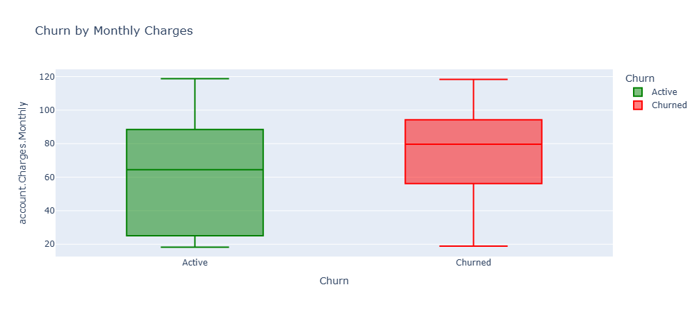
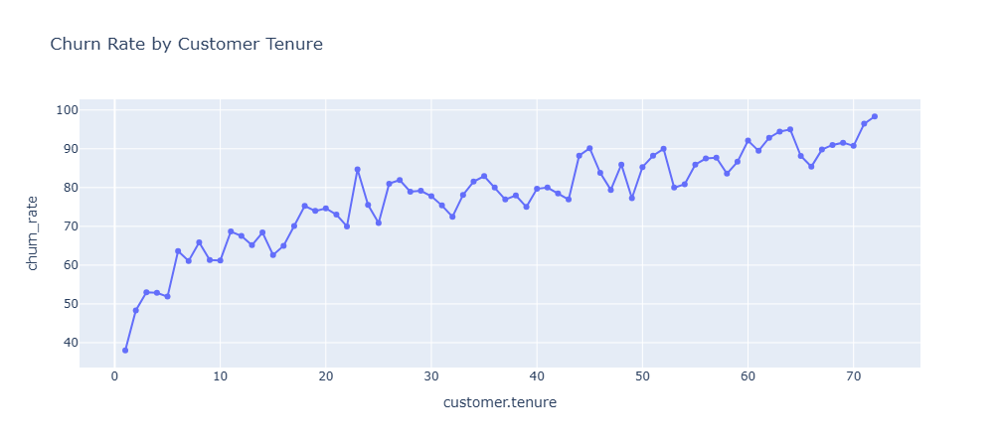
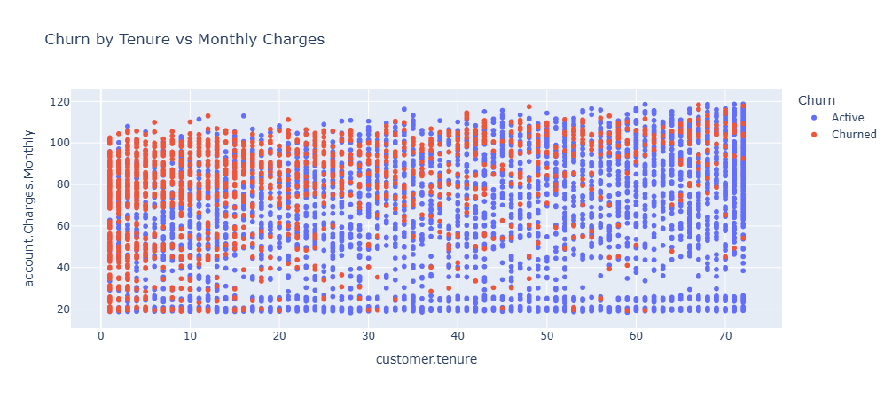

# 📊 Análisis de Evasión de Clientes – TelecomX LATAM

## 📌 Problema a Analizar

La retención de clientes es un factor clave para la sostenibilidad de las empresas de telecomunicaciones. Dentro del papel como asistente de análisis de datos en Telecom X, formaré parte del proyecto "Churn de Clientes". En este análisis se busca comprender los factores que influyen en la **evasión de clientes (churn)** dentro de la compañía **TelecomX LATAM**, para identificar patrones y generar recomendaciones que ayuden a reducir la tasa de abandono.

---

## 🎯 Objetivo

Mi desafío será recopilar, procesar y analizar los datos, utilizando Python y sus principales bibliotecas para extraer información valiosa. A partir del análisis, el equipo de Data Science podrá avanzar en modelos predictivos y desarrollar estrategias para reducir la evasión.

* Identificar variables clave que impactan en la decisión de un cliente de abandonar el servicio.
* Analizar la relación entre el churn y las características demográficas, de servicio y de facturación.
* Generar visualizaciones que faciliten la interpretación de los datos y la comunicación de resultados.
* Proponer estrategias basadas en evidencia para mejorar la retención.

---

## 🛠️ Metodología

1. **Carga y exploración de datos** desde el dataset `TelecomX_LATAM`.
2. **Limpieza y normalización** de variables para evitar inconsistencias.
3. **Análisis descriptivo** para comprender la distribución de las variables.
4. **Visualizaciones interactivas** usando `Plotly Express` y `Matplotlib`.
5. **Análisis de correlación** para detectar relaciones relevantes.
6. **Interpretación y síntesis** de hallazgos clave para la toma de decisiones.

---

## Diccionario de dato

Descripción de cada columna:

* customerID: número de identificación único de cada cliente
* Churn: si el cliente dejó o no la empresa
* gender: género (masculino y femenino)
* SeniorCitizen: información sobre si un cliente tiene o no una edad igual o mayor a 65 años
* Partner: si el cliente tiene o no una pareja
* Dependents: si el cliente tiene o no dependientes
* tenure: meses de contrato del cliente
* PhoneService: suscripción al servicio telefónico
* MultipleLines: suscripción a más de una línea telefónica
* InternetService: suscripción a un proveedor de internet
* OnlineSecurity: suscripción adicional de seguridad en línea
* OnlineBackup: suscripción adicional de respaldo en línea
* DeviceProtection: suscripción adicional de protección del dispositivo
* TechSupport: suscripción adicional de soporte técnico, menor tiempo de espera
* StreamingTV: suscripción de televisión por cable
* StreamingMovies: suscripción de streaming de películas
* Contract: tipo de contrato
* PaperlessBilling: si el cliente prefiere recibir la factura en línea
* PaymentMethod: forma de pago
* Charges.Monthly: total de todos los servicios del cliente por mes
* Charges.Total: total gastado por el cliente

---
## 📈 Principales Hallazgos

* La evasión es **más alta en clientes con menor tiempo de permanencia** y tarifas mensuales elevadas.
* Ciertos servicios adicionales como **seguridad online** y **soporte técnico** están asociados a menor churn.
* El tipo de contrato influye fuertemente: **contratos mensuales** presentan tasas mucho más altas de evasión frente a contratos a largo plazo.
* La facturación **sin papel (paperless)** se correlaciona con una mayor tasa de churn.
* Variables como **ser senior citizen** o **tener dependientes** muestran influencia, pero menor comparada con los factores de servicio y facturación.

---

## 📊 Visualizaciones Clave

### 1. **Churn por Cargos Mensuales**


Se observa un aumento de churn en clientes con cargos mensuales altos, especialmente en los primeros meses de contrato.

---

### 2. **Churn vs Tenure (Tiempo como Cliente)**


Clientes con menos de 12 meses presentan la mayor evasión. A partir de cierto punto, la tasa de churn se estabiliza.

---

### 3. **Tenure vs Cargos Mensuales por Churn**


La combinación de **baja permanencia** y **altos cargos mensuales** es un fuerte predictor de evasión.

---

## 👥 Perfil del Cliente Analizado

* Variables demográficas: `SeniorCitizen`, `Partner`, `Dependents`.
* Variables de suscripción: `PhoneService`, `MultipleLines`, `InternetService`, `OnlineSecurity`, `StreamingTV`, entre otras.
* Variables de facturación: `Contract`, `PaperlessBilling`, `PaymentMethod`, `Charges.Monthly`, `Charges.Total`, `Charges.Daily`.

---

## 🔍 Variables Correlativas

* Alta correlación positiva entre `Charges.Total` y `Tenure` (esperable por acumulación en el tiempo).
* Correlación negativa entre `Tenure` y `Churn`.
* Relación positiva entre cargos mensuales y churn, pero moderada.

---

## 📌 Conclusiones y Recomendaciones

1. **Focalizar retención en clientes nuevos**: ofrecer descuentos o beneficios durante los primeros 12 meses.
2. **Revisar estructura de precios** para clientes con cargos mensuales altos.
3. **Promover servicios complementarios** como seguridad online y soporte técnico, que muestran relación con menor churn.
4. **Incentivar contratos a largo plazo**, ya que reducen la probabilidad de abandono.
5. Monitorear periódicamente la correlación de variables y actualizar estrategias.

---

## 📂 Estructura del Proyecto

```
📁 TelecomX_LATAM
 ├── src/                   # Notebook principal y auxiliar con análisis y visualizaciones
 ├── assets/                # PNGs de gráficos
 ├── data/                  # Dataset de entrada
 └── README.md              # Informe del análisis
```

---

## 💻 Tecnologías Utilizadas

* Python 3.12
* Pandas, NumPy (manejo y análisis de datos)
* Plotly Express, Matplotlib (visualizaciones)
